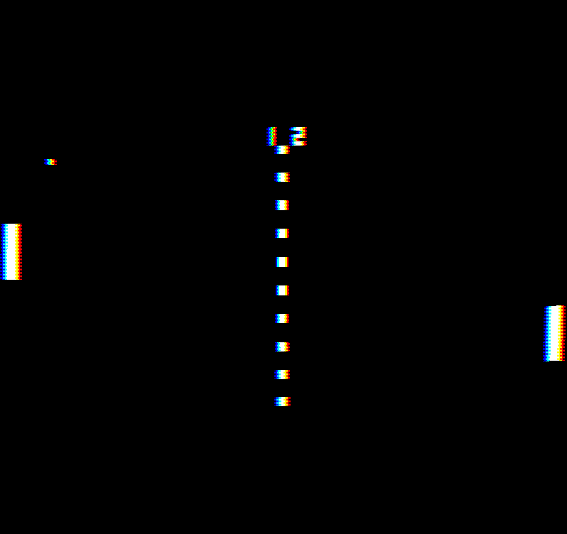
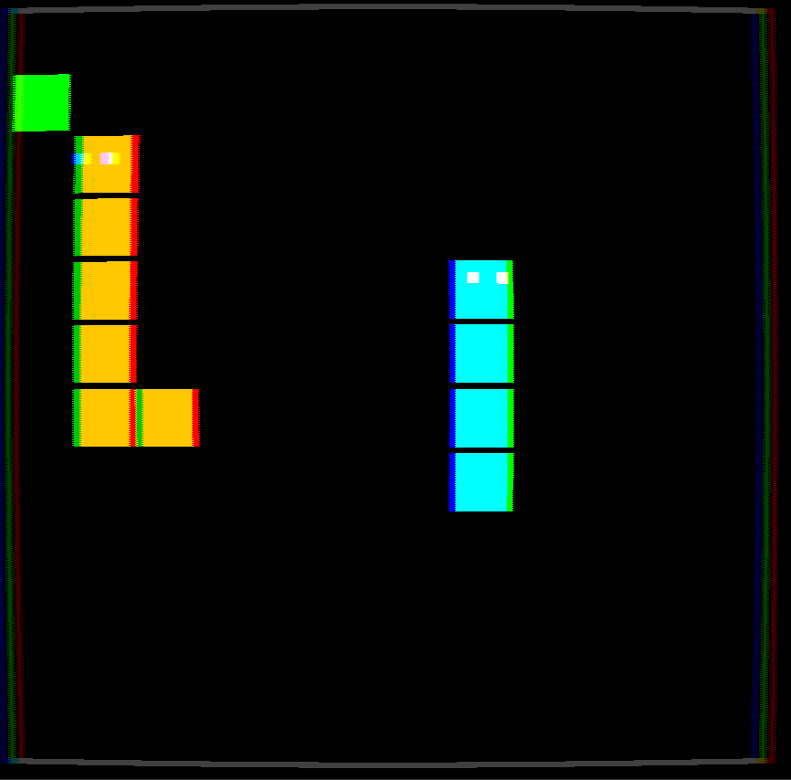

# retro-games

A quick and dirty playground for random (mostly retro) games.

| | |
|-|-|
|  |  |

## Contributing

1. fork the repo
2. add it as a maven project in your IDE
3. update maven dependencies if your IDE does not do it itself
4. add `/res` as source folders 
    - eclipse: right click-\>build path-\>use as source folder
    - intelliJ: go in properties and find it yourself you dummy
5. add a new package in `fr.wonder.games` and add your game in the switch case of `RetroGames.java`
6. Code!

**Note**: if maven does not work for you, you may also copy the jars from [here](https://github.com/Akahara/retro-games/tree/2e54bc833e95562649c25a2eae93b906363ca2e6/lib) and add them to your build path, only do this as a last resort.

If you have to update code outside of `fr.wonder.games` mention it in your commits.

Once you're finished, create a pull request - do not forget to sign your work!

